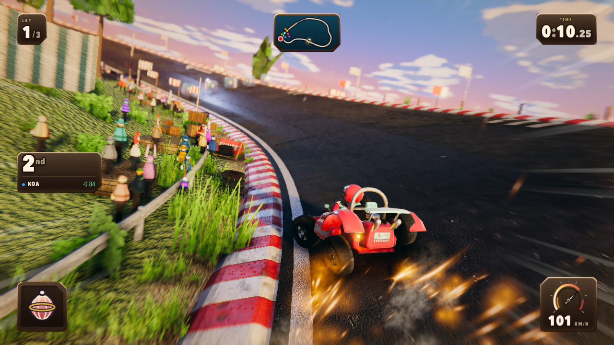

# Kart Mirage

A Mario Kart-style racer in the browser. **No art assets.** No Blender, no Unity,
no textures, no models, no fonts, no audio files — every mesh, texture, sound and
note is generated in code at load time.



*Every pixel above is generated at runtime. The kerb stripes, the crowd, the tyre
tread, the sparks, the sky — there is not a single image file in this repository.*

## Running it

```bash
npm install
npm run dev       # vite dev server → http://localhost:5173
npm run build     # tsc --noEmit && vite build
npm run preview   # serve the production build
```

The build gate is `npm run build`; it must pass. On a phone, add the page to the
home screen — the manifest drops the browser chrome and the game runs fullscreen
in landscape.

## What's in the box

- A full race loop: title screen, character select, three laps, results, and a
  roster of karts with different stat profiles.
- Drift-to-boost with a mini-turbo ladder, items, projectiles, and an AI field
  that drifts corners and fights for position.
- An Amalfi-style coastal circuit built procedurally: village, cliffs, water,
  foliage, crowd, and trackside signage — all geometry and shader work.
- A procedural sky raymarched into an environment probe at boot, driving the
  lighting, haze and reflections for the whole scene.
- Synthesised engine audio, music and effects — no audio files.
- Desktop keyboard and four mobile touch-control schemes, with saved
  preferences and an onboarding pass.
- A replay recorder (saves a `.webm` of the race) and adaptive resolution that
  spends pixels to protect frame rate.

## Controls

| input | keyboard | touch |
|---|---|---|
| steer | ← → or A D | steering cluster / tilt, per scheme |
| accelerate | ↑ or W | accelerator button |
| brake / reverse | ↓ or S | brake button |
| drift | Space or Shift | drift button |
| use item | Enter or E | item button |
| pause | Escape | pause button |

## Layout

One concern per directory; `src/types.ts` is the interface every subsystem codes
against.

| path | what lives there |
|---|---|
| `src/render/` | renderer, post chain, procedural textures/materials, sky |
| `src/world/` | track layout + geometry, scenery, foliage, water |
| `src/kart/` | chassis, suspension, tyres, model, liveries |
| `src/game/` | race state, AI, camera, items, projectiles |
| `src/fx/` | particles, trails, decals |
| `src/ui/` | HUD, menus, minimap |
| `src/audio/` | synthesis, music, engine |
| `src/core/` | input, settings, diagnostics, prewarm, event bus |
| `tools/` | headless measurement harnesses (fps, fill, drift, touch latency, …) |

`AGENTS.md` is the working note for this repo — the contract, the traps that
already cost a round, and how to verify a change. `ART_DIRECTION.md` is the
visual bar the frame is scored against.

## License

MIT — see [LICENSE](LICENSE).
